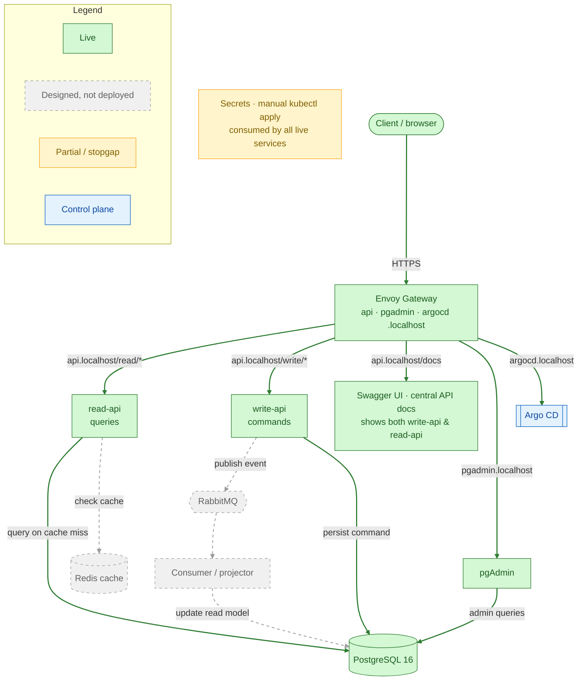
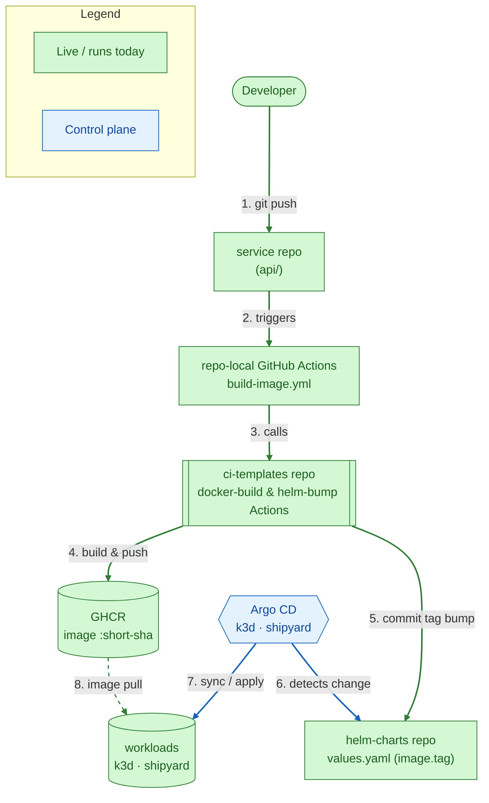

# CJs-Shipyard — Platform Docs

Architecture diagrams, request-flow diagrams, and design decisions for **CJs-Shipyard**,
a local, production-style **GitOps Kubernetes** platform.

## What it is

CJs-Shipyard is a personal, portfolio-grade platform that runs a small product/inventory service
where reads and writes are handled by separate services (**CQRS-lite**) and each component of
the platform has its own repository (**poly-repo** structure).
- Kubernetes workloads are packaged with **Helm**.
- **Argo CD** keeps the cluster in sync with what's committed to Github.
- A local **k3d** cluster is standing in for a managed Kubernetes environment like EKS. 

The project exists to practice and demonstrate the *operational* side of software — GitOps, 
progressive delivery, least-privilege data access, and clean service boundaries.

> **Honesty note (it's a portfolio piece and playground):** some designed components are not built yet.
> What is **running today** is the read/write API split, PostgreSQL, pgAdmin, the **Envoy Gateway
> edge with the central Swagger UI**, and Argo CD. RabbitMQ, Redis,
> Vault/External-Secrets, and the observability stack are **designed but not deployed**.
> The colour-coded architecture diagram below is the source of truth for what is live.

## Tech stack & repositories

This table defines each layer/component of the platform, which repo owns it (if any), and whether it is
actually running in my cluster.

| Layer / component | Technology | Repo | Status |
|---|---|---|---|
| API services | Python 3.12 · FastAPI · SQLAlchemy 2 (async) · Alembic | `api` | ✅ Live |
| Database | PostgreSQL 16 (StatefulSet, `local-path` PVC) | `postgres` | ✅ Live |
| DB admin UI | pgAdmin 4 | `postgres` | ✅ Live |
| Ingress / edge | Envoy Gateway (Gateway API) | `helm-charts` | ✅ Live |
| API docs | Swagger UI (central page at `api.localhost`) | `api` | ✅ Live |
| Packaging | Helm (one chart per deployable) | `helm-charts` | ✅ Live |
| GitOps / CD | Argo CD (app-of-apps) | `argocd` | ✅ Live |
| CI | GitHub Actions + reusable workflows | `ci-templates` | ✅ Live |
| Image registry | GitHub Container Registry (GHCR) | — | ✅ Live |
| Local cluster | k3d (single-node today) | — | ✅ Live |
| Message queue | RabbitMQ (async write path) | `rabbitmq` | 🟡 Planned |
| Cache | Redis (read-side cache) | `redis-cluster` | 🟡 Planned |
| Secrets | Vault + External Secrets Operator | — | 🟡 Planned (manual today) |
| Observability | OpenTelemetry · Loki · Grafana | — | 🟡 Planned |

**Poly-repo** — every component is its own repository under the `CJs-Shipyard` org. Rows with a
`—` are platform / SaaS layers (registry, cluster, secrets, observability) with no dedicated repo.

## Diagrams

### 1. Architecture & live status

Overarching view of the platform — **color defines reality.** Apart from the client, every
component here lives in the local k3d `shipyard` cluster and is delivered by Argo CD;
Diagram 2 shows how.

**Edges** (the legend covers node colors):

- **Solid green** — live request / data path
- **Grey dashed** — designed, not deployed

The planned Observability stack (OTel · Loki · Grafana) is omitted here for clarity; see the
table above and [observability.md](./docs/observability.md).

### 2. GitOps delivery flow

How a code change becomes a running pod — no manual `kubectl apply` of workloads. Steps are
numbered 1–8 in causal order. The flow forks at `ci-templates` into an image branch (4, 8) and
a chart branch (5, 6), which reconverge in the cluster. Same colour language as Diagram 1:
green = runs today, blue = Argo CD (control plane); dashed green = image pull.

## Where to look next

- [Architecture overview](./docs/architecture.md) — components, responsibilities, namespaces
- [Local setup guide](./docs/local-setup.md) — stand it up in your own cluster [beta]
- [Observability](./docs/observability.md) — the planned OTel / Loki / Grafana approach
- [Conventions](./docs/conventions.md) — how to contribute changes
- [Architecture Decision Records](./docs/adr/README.md) — why the platform is shaped this way
- [Docs index](./docs/README.md)
