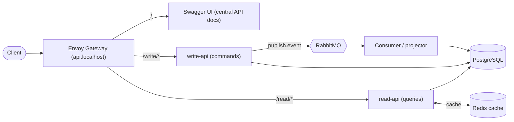
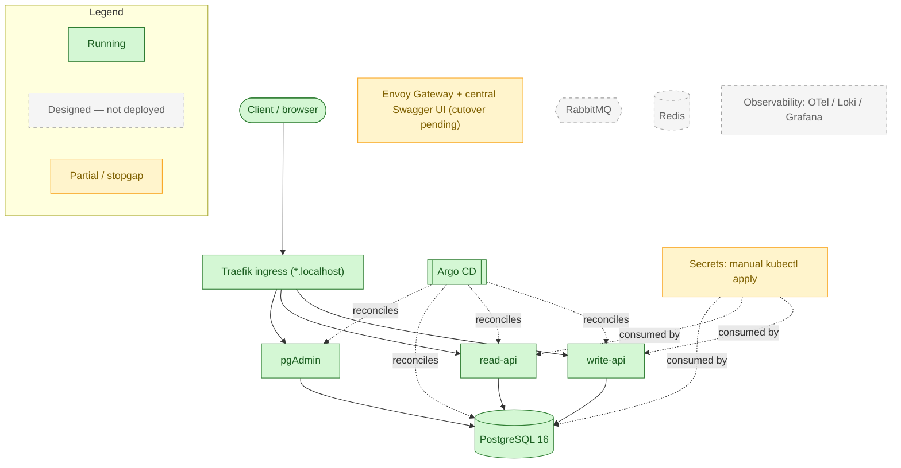
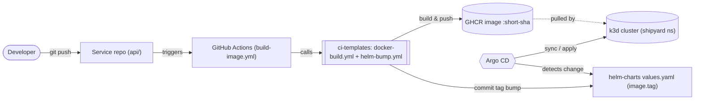

# CJs-Shipyard — Platform Docs

Architecture diagrams, request-flow diagrams, and design decisions for **CJs-Shipyard**,
a local, production-style **GitOps Kubernetes** platform.

## What it is

CJs-Shipyard is a personal, portfolio-grade platform that runs a small product/inventory service
the way a real shop would: reads and writes handled by separate services (**CQRS-lite**), each
component in its own repository (**poly-repo**), workloads packaged with **Helm**, **Argo CD**
keeping the cluster in sync with what's committed to Git, and a local **k3d** cluster standing in
for a managed Kubernetes environment. It exists to practice and demonstrate the *operational* side of
software — GitOps, progressive delivery, least-privilege data access, and clean service boundaries —
on hardware you already own, with no cloud bill.

> **Honesty note (it's a portfolio piece):** several designed components are not built yet.
> What is **running today** is the read/write API split, PostgreSQL, pgAdmin, Traefik ingress, and
> Argo CD. The **Envoy Gateway edge + central Swagger UI** ([ADR-0007](./docs/adr/0007-envoy-gateway-edge.md),
> [ADR-0008](./docs/adr/0008-central-api-docs.md)) are implemented in `helm-charts`/`argocd` but
> awaiting cluster Instantiation. RabbitMQ, Redis, Vault/External-Secrets, and the observability stack
> are **designed but not deployed**. Diagram 2 below is the source of truth for what is live.

## Tech stack

| Layer | Technology | Status |
|-------|-----------|--------|
| API services | Python 3.12 · FastAPI · SQLAlchemy 2 (async) · Alembic | ✅ Live |
| Database | PostgreSQL 16 (StatefulSet, `local-path` PVC) | ✅ Live |
| DB admin UI | pgAdmin 4 | ✅ Live |
| Packaging | Helm (one chart per deployable) | ✅ Live |
| GitOps / CD | Argo CD (app-of-apps) | ✅ Live |
| CI | GitHub Actions + reusable `ci-templates` | ✅ Live |
| Image registry | GitHub Container Registry (GHCR) | ✅ Live |
| Local cluster | k3d (single-node today) | ✅ Live |
| Ingress / edge | Traefik (k3d built-in) | ✅ Live (until edge cutover) |
| Edge gateway | Envoy Gateway (Gateway API, replaces the Nginx `gateway-proxy` plan — ADR-0007) | 🟡 Implemented, cutover pending |
| API docs | Swagger UI (central page at `api.localhost` — ADR-0008) | 🟡 Implemented, cutover pending |
| Message queue | RabbitMQ (async write path) | 🟡 Planned |
| Cache | Redis (read-side cache) | 🟡 Planned |
| Secrets | Vault + External Secrets Operator | 🟡 Planned (manual today) |
| Observability | OpenTelemetry · Loki · Grafana | 🟡 Planned |

## Diagrams

### 1. Designed client traffic flow (target architecture)

The full intended request path. Several nodes here are **not deployed yet** — see Diagram 2 for the
honest live view.

### 2. Live status (what is actually running)

Verified against the running k3d cluster. The legend distinguishes what is deployed from what is
only designed.

### 3. GitOps delivery flow

How a code change becomes a running pod, with no manual `kubectl apply` of workloads.

## Repositories

Each sibling repo is independent (poly-repo). The org is `CJs-Shipyard`.

| Repo | Role |
|------|------|
| `api` | FastAPI `read-api` + `write-api`, shared SQLAlchemy models, Alembic migrations |
| `helm-charts` | Helm charts for every deployable — the single source of truth Argo CD deploys |
| `argocd` | GitOps wiring: app-of-apps, `Application`/`AppProject` manifests, day-0 bootstrap |
| `ci-templates` | Reusable GitHub Actions workflows (`docker-build`, `helm-bump`) |
| `postgres` | Local Postgres + pgAdmin via docker-compose; provisions per-service DB roles |
| `gateway-proxy` | Nginx edge gateway — *superseded by Envoy Gateway ([ADR-0007](./docs/adr/0007-envoy-gateway-edge.md)); will not be built* |
| `rabbitmq` | Message queue — *planned* |
| `redis-cluster` | Read cache — *planned* |

## Where to look next

- [Architecture overview](./docs/architecture.md) — components, responsibilities, namespaces
- [Local setup guide](./docs/local-setup.md) — stand it up in your own cluster
- [Observability](./docs/observability.md) — the planned OTel / Loki / Grafana approach
- [Conventions](./docs/conventions.md) — how to contribute changes
- [Architecture Decision Records](./docs/adr/README.md) — why the platform is shaped this way
- [Docs index](./docs/README.md)
